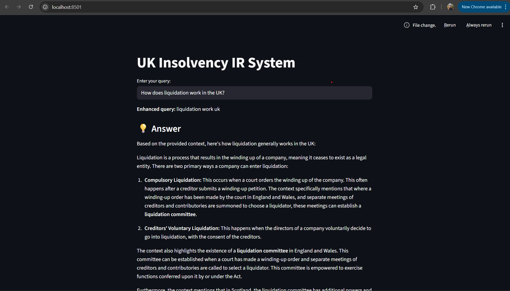

# UK Insolvency Information Retrieval System Using RAG

A domain-specific RAG (Retrieval-Augmented Generation) system built with Python that allows users to search through UK insolvency law documents using AI-powered semantic search and generates accurate answers using Google Gemini LLM, grounded in verified legal text.

## How It Works

The system processes UK insolvency law files, converts them into vector embeddings and stores them in vector database. The system improves user queries through spell checking and stop-word elimination before it obtains the most relevant document chunks through semantic search and uses a cross-encoder model to enhance result accuracy.
## Key Components

- **Data Layer** — Loads PDF documents, splits them into chunks, creates vector embeddings and stores them in ChromaDB.
- **Query Intelligence** — Cleans punctuation, corrects spelling mistakes and removes stop words to improve search accuracy.
- **Ranking Engine** — Uses cross-encoder to re-rank search results for more accurate results.
- **RAG (Answer Generation)** — Uses Google Gemini LLM to generate accurate answers grounded in the retrieved document chunks, reducing hallucination.
- **User Interface** — A Streamlit web app for real-time and result display.

Sample outputs:


## Tech Stack

- Python
- ChromaDB (Vector Database)
- Sentence Transformers (Embeddings & Re-ranking)
- Google Gemini API (Answer Generation)
- Streamlit (UI)
- LangChain Text Splitters (Document Chunking)
- NLTK & PySpellChecker (Query Processing)

## Setup
```bash
pip install -r requirements.txt
```

Create a `.env` file with your Google Gemini API key:
```
GOOGLE_API_KEY=your_api_key_here
```

Build the index (run once):
```bash
python build.py
```

Run the app:
```bash
streamlit run app.py
```
